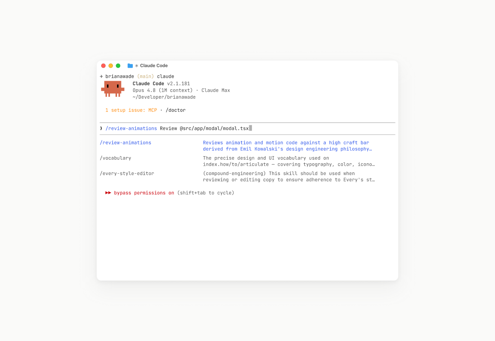
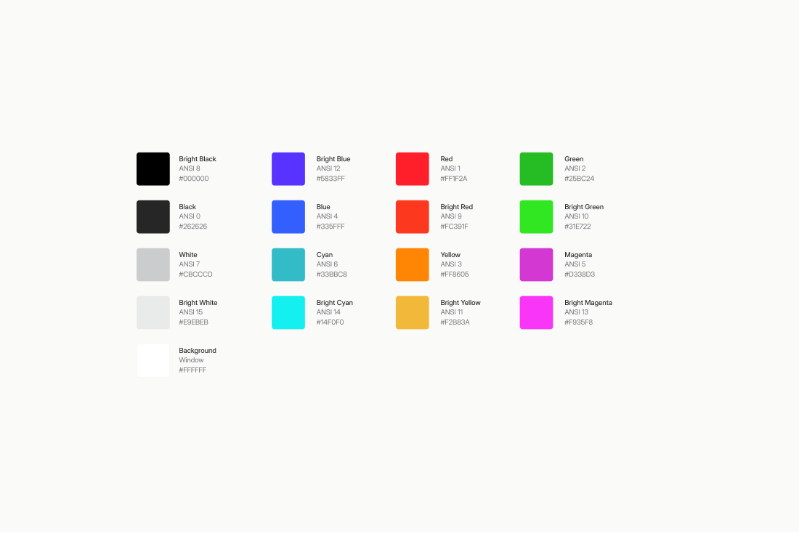

**WRGB**

A light Ghostty theme for macOS. One file, hand-maintained: a white plate, near-black text, and saturated ANSI colors.





**Install**

```sh
mkdir -p ~/.config/ghostty/themes
cp wrgb ~/.config/ghostty/themes/
```

Set `theme = wrgb` in `~/.config/ghostty/config`.

Values in `config` override the theme file, so don't also set colors or `background-opacity` there.

